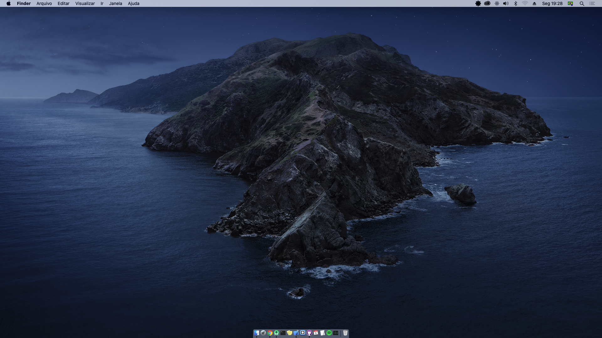

# Mac Catalina Vostro 5470

Project to try to install Mac Catalina on PC Vostro 5470 A10.
 
## Instructions

 - Download [OSXR Catalina 10.15.2 -Dell inspiron 5000.img](https://drive.google.com/file/d/1I5kl-S4vGMquJkCGrjjJytQlLaLyDBOR/view)
 - Create a disk drive using the [Balena Etcher](https://www.balena.io/etcher/) program.
 - Copy the files from the [EFI](/EFI) folder to the "EFI" partition on the flash drive.
     - [Mount EFI partition on MAC OS.](mount-efi-mac.md)
     - [Mount EFI partition on Windows.](mount-efi-windows.md)
 - Use the flash drive to boot and install normally, until this error occurs:
 

 - After that, the screen will turn black and press the space key several times.
 - The HD led will start to flash, only stop pressing the space key if the HD led will no longer flash; in that case, you turn the power button on and off again and continue the installation or until the progress bar appears.
 
 > Whenever the screen goes black, repeat this step.
 
## Special thanks
 
Special thanks to [Clovijan](https://github.com/Clovijan), without him installation would not be possible.

## Result

 
## Help Links
 
  - [Dell Vostro 5470 Hackintosh](https://github.com/coisadepro/Vostro-5470-Hackintosh)
  - [USB Wifi TL-WN727N](https://github.com/coisadepro/TL-WN727N-macOS)
  - [Shutdown Patch](https://github.com/coisadepro/5470-shutdown-patch)
  - [Tony Mac x86](https://www.tonymacx86.com/threads/vostro-5470.273654/)
  - [SUCCESS HACKINTOSH MACOS CATALINA 10.15 BUILD 19A602 AT DELL VOSTRO 5470](https://www.installhackintosh.com/installed-hackintosh-system/307-success-hackintosh-macos-catalina-10-15-build-19a602-at-dell-vostro-5470)
  - [Catalina 10.15 build 19a602](https://drive.google.com/drive/folders/1Vsm7wk5BxvKSiDb1W6YBwSVCTh75jlvK)
  - [Catalina 10.15.3 ISO](http://www.mediafire.com/file/470x2ktvxc9bxdx/Catalina_10.15.3_ISO_File_By_intoguide.com.iso/file)
  
## License
 
MIT License

Copyright (c) 2020 Wictor Chaves

Permission is hereby granted, free of charge, to any person obtaining a copy
of this software and associated documentation files (the "Software"), to deal
in the Software without restriction, including without limitation the rights
to use, copy, modify, merge, publish, distribute, sublicense, and/or sell
copies of the Software, and to permit persons to whom the Software is
furnished to do so, subject to the following conditions:

The above copyright notice and this permission notice shall be included in all
copies or substantial portions of the Software.

THE SOFTWARE IS PROVIDED "AS IS", WITHOUT WARRANTY OF ANY KIND, EXPRESS OR
IMPLIED, INCLUDING BUT NOT LIMITED TO THE WARRANTIES OF MERCHANTABILITY,
FITNESS FOR A PARTICULAR PURPOSE AND NONINFRINGEMENT. IN NO EVENT SHALL THE
AUTHORS OR COPYRIGHT HOLDERS BE LIABLE FOR ANY CLAIM, DAMAGES OR OTHER
LIABILITY, WHETHER IN AN ACTION OF CONTRACT, TORT OR OTHERWISE, ARISING FROM,
OUT OF OR IN CONNECTION WITH THE SOFTWARE OR THE USE OR OTHER DEALINGS IN THE
SOFTWARE.
