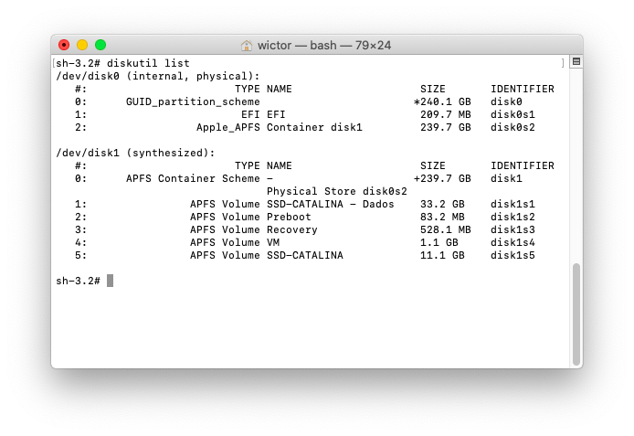

# Mount EFI partition on MAC OS

Find the identifier number for your EFI partition by running: 
 
     diskutil list 
     
You should see something like this:

To make the said mount point, run the following:

    sudo mkdir /Volumes/EFI
    
With that done, we can finally mount the EFI partition by running the following:

    sudo mount -t msdos /dev/disk0s1 /Volumes/EFI
    
[Source](https://www.modmy.com/how-mount-your-efi-partition-macos)
