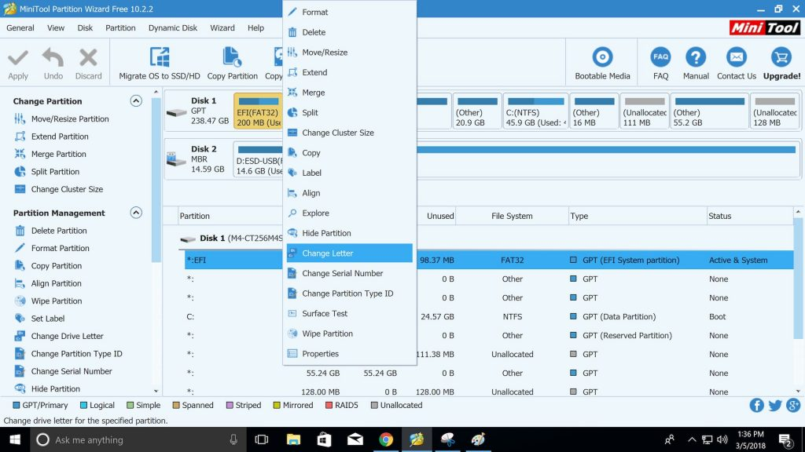
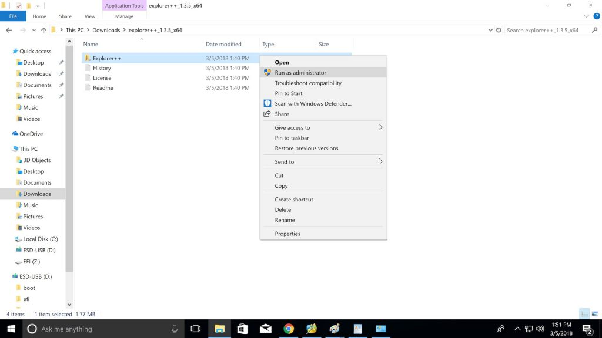
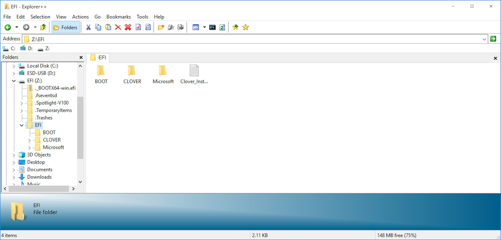

# Mount EFI partition on Windows

## Mount EFI Partition on Windows

 - Install [MiniTool Partition Wizard Free Edition](https://www.partitionwizard.com/free-partition-manager.html?irgwc=1&media_partner_id=10078&campaign_id=9904&tracker_id=17660&irclickid=SezTZqRP4xyOTodwUx0Mo3IUUkiw%3Aux7R10t0U0)
 - Open MiniTool Partition Wizard
 - Right-Click the EFI partition and click Change Letter
 
 
 
 - Select an unused drive letter (I picked L:)
 - Click Apply
 - Apply pending Changes? : Yes
 - Click OK
 
## Access & Edit EFI partition on Windows

 - Download [Explorer++](https://explorerplusplus.com/)
 - Unzip explorer++.zip by right-clicking the zip file and selecting Extract All… and click Extract
 - Open the now unzipped explorer++ folder
 - Right-Click Explorer++ and select Run as administrator
 

 
 - You should now see your EFI folder which you can open and make changes too through the Explorer++ program.
 

 - Done.
 
[Source](https://hackintosher.com/guides/how-to-mount-and-edit-macos-efi-partition-directly-on-windows/)
